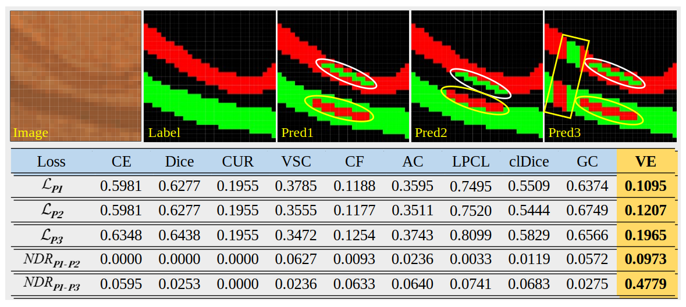
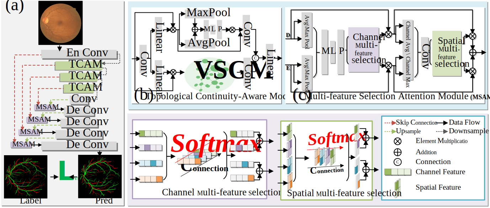
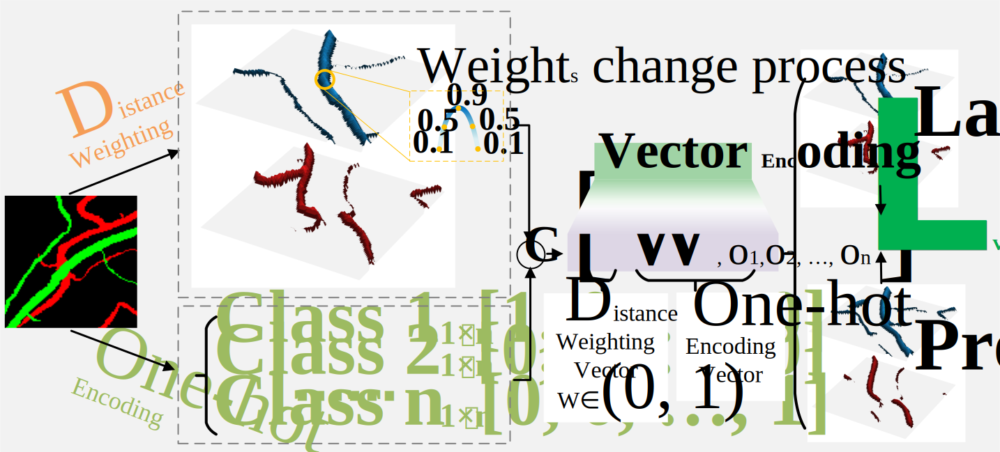

## IVGNet: Graph Modeling and Vector-Encoded Loss for Enhancing Topological Continuity in Retinal Artery-Vein Segmentation

### 1. Motivation

Figure 1. Research motivations and challenges in artery-vein segmentation. (a) IVGA enhance the learning of global artery-vein features through graph structures while suppressing irrelevant background features. (b) Different loss functions exhibit varying sensitivity to the spatial positions of mis-segmented vascular pixels, with the VE loss demonstrating the highest sensitivity to the locations of incorrectly segmented vascular pixels. Here, NDR denotes the normalized difference, and Pred1 (Pred2) represents segmentation results with the same number of mis-segmented pixels but at different spatial locations.

 
 
Figure 2. Comparison chart of the differences between IVGNet and other models.

### 2. Methods

 

Figure 3. Overview of Our Method. (a) IVGNet model architecture. Skip connections between the encoder and decoder utilize MSAM to remove redundant features, and VE Loss constrains the predicted results against the ground truth. (b) IVGM architecture. The node selection function selects vascular nodes to construct a vascular graph structure. Graph convolution is used to enhance global vascular node features while suppressing non-vascular features. (c) MSAM architecture. High-confidence vascular features are selected along channel and spatial dimensions using a Softmax function.

